# 리모 레퍼런스 수집 결과

확인일: 2026-09-17. 후보 12개, 원리 참고 5개, 반면 사례 2개, 보류 5개. 데스크톱/모바일 14장. 외부 게시 없음. 사이트 구현 변경 없음.

## [Moniker — About us](https://studiomoniker.com/about)

우선 참고 · 사람과 정체성

- **검토 질문:** 큰 제목 없이도 누구인지 전달할 수 있는가?
- **관찰:** 첫 화면은 간단한 메뉴와 실제 인물의 실험적인 사진으로 시작한다. 사진 아래에서 공동 활동과 개인 웹사이트를 연결한다. 소개에 따르면 스튜디오는 2023년 종료했고 개인 활동과 협업을 이어간다.
- **가져올 원리:** 성격을 설명하는 슬로건 대신, 그 사람이 실제로 하는 행동을 보여준다.
- **리모 적용 제안:** 리모의 첫 화면과 사람 소개. 단체 기념사진만 반복하지 말고 실제 작업 중인 사람과 그 작업을 연결한다.
- **필요한 실제 자료:** 누가 어떤 작업에 참여했는지 확인된 사진 설명과 개인 작업 링크.
- **한계 / 가져오지 않을 것:** 사진 자체가 강한 사례다. 평범한 사진에 같은 배치를 적용한다고 같은 힘이 생기지는 않는다. 본문 분량도 그대로 모방하지 않는다.
- **모바일 관찰:** 왼쪽 메뉴가 위로 이동하고 사진과 본문이 한 열로 이어지는 장면을 확인했다.

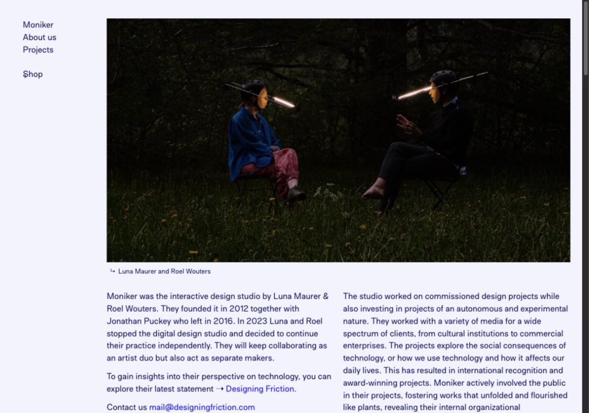

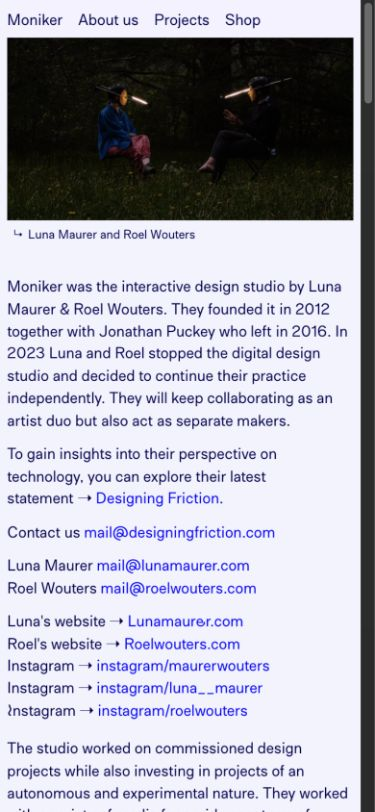

## [Conditional Design — Networks](https://conditionaldesign.org/workshops/networks/)

우선 참고 · 과정의 증거

- **검토 질문:** 실험과 수정은 어디서 구체적으로 볼 수 있는가?
- **관찰:** 2009년 실험의 1차·2차 결과 사진과 각 라운드 영상, 참여 규칙을 한 페이지에 둔다. 역할을 교대하는 방식도 설명한다.
- **가져올 원리:** 결과물만 전시하지 않고, 같은 조건에서 무엇이 달라졌는지 비교 가능하게 만든다.
- **리모 적용 제안:** 프로젝트 상세의 시도 기록. 날짜·조건·시도한 것·관찰·다음 수정과 원본 화면을 연결한다.
- **필요한 실제 자료:** 같은 작업의 두 버전, 그 차이가 생긴 이유. 없는 실패나 성과를 만들지 않는다.
- **한계 / 가져오지 않을 것:** 큰 제목은 가져오지 않는다. 이 사례는 반복 과정의 기록이지 사업 성과나 실패 회고의 증거는 아니다. 과거 사이트의 화면 설계를 그대로 복제하지 않는다.
- **모바일 관찰:** 390px 화면에서 가로 잘림과 가로 스크롤이 보였다. 기록 구조만 채택하고 반응형은 새로 설계해야 한다.

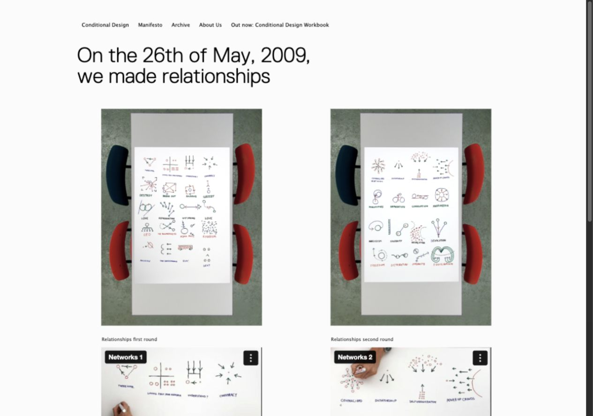

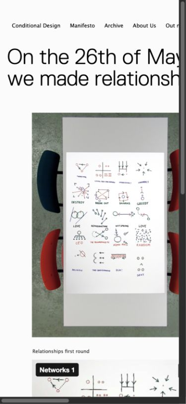

## [Luna Maurer](https://lunamaurer.com/)

부분 참고 · 개인의 활동

- **검토 질문:** 사람의 개성을 실제 활동으로 보여줄 수 있는가?
- **관찰:** 데스크톱은 인물·퍼포먼스 미디어와 소개·예정 활동·작업 목록을 나란히 둔다. 진행 중 연구를 작업 목록에서 명시한다.
- **가져올 원리:** 개인을 성격 태그로 단정하지 않고, 관심사와 현재 하는 일로 이해하게 한다.
- **리모 적용 제안:** 멤버별 소개를 실제 발언 한 문장과 현재 참여 작업으로 구성한다. 외부 개인 작업이 있다면 연결한다.
- **필요한 실제 자료:** 본인이 확인한 짧은 소개나 발언, 작업별 기여, 공개 가능한 사진.
- **한계 / 가져오지 않을 것:** 이 개인 작가의 영상 의존 구성을 열 명에게 복제하면 무겁고 산만해진다. 보라색과 영상 효과는 채택 대상이 아니다.
- **모바일 관찰:** 수집한 모바일 장면은 소개와 작업 목록 중심으로 보인다. 데스크톱의 미디어 인상이 그대로 유지된다고 보장할 수 없다. 영상 조작 전체는 미검증.

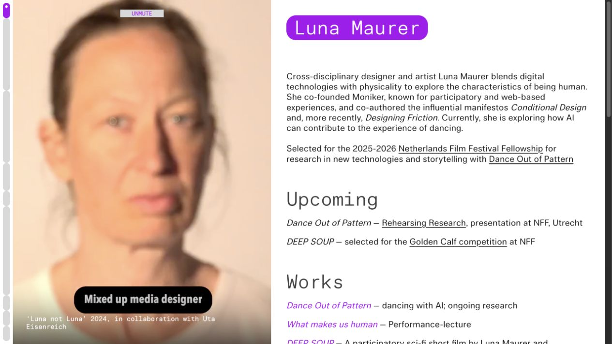

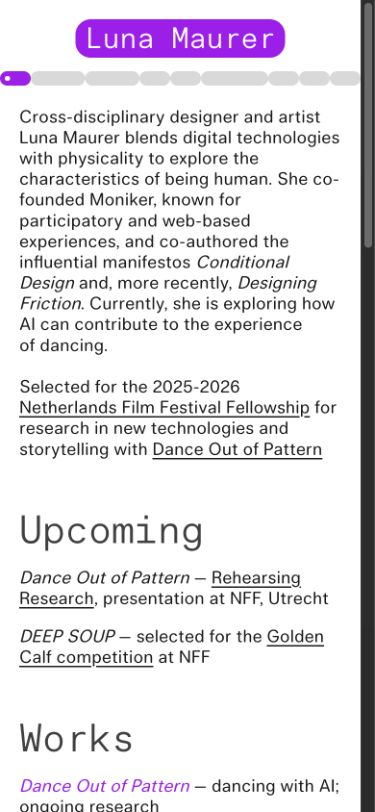

## [Are.na — Search](https://www.are.na/search)

부분 참고 · 자료의 관계

- **검토 질문:** 서로 다른 형식의 기록을 한곳에 어떻게 담을까?
- **관찰:** 이미지와 텍스트 채널이 같은 탐색 영역에 놓인다. 채널에는 작성자·블록 수 등의 정보가 붙고, 형식·검색 필드·정렬을 나눈다.
- **가져올 원리:** 모든 자료를 같은 디자인으로 꾸미기보다, 서로 연결되는 기록 단위로 취급한다.
- **리모 적용 제안:** 리모의 사진·메모·작업 화면을 프로젝트와 작성자로 연결한다. 기록이 적은 현재는 필터 없이 직접 보여준다.
- **필요한 실제 자료:** 각 자료의 작성자, 관련 프로젝트, 날짜와 설명.
- **한계 / 가져오지 않을 것:** 검색 서비스의 전체 UI는 리모에게 과하다. 빈 그리드, 블록 수, 업데이트 시간 같은 숫자를 장식으로 가져오지 않는다.
- **모바일 관찰:** 모바일에는 두 열 자료와 가로로 넘기는 필터가 보였다. 상단 필터가 넓은 면적을 차지하므로 그대로 모방하지 않는다.

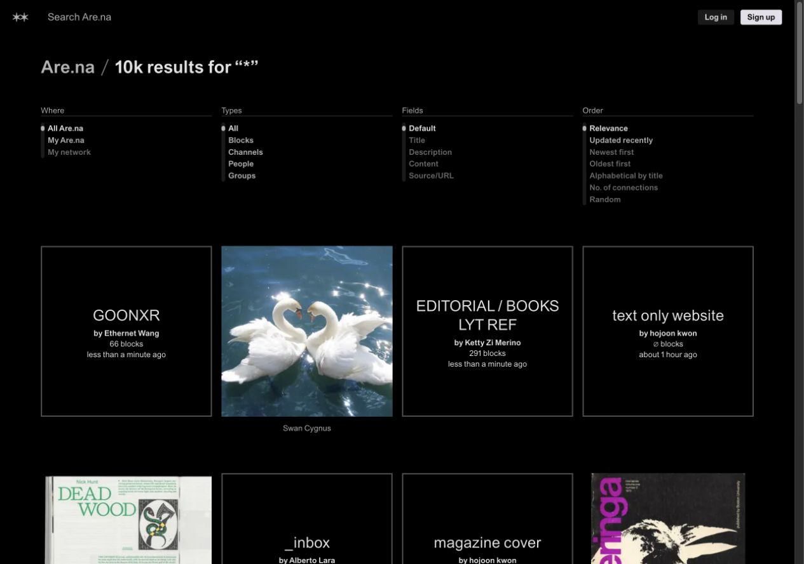

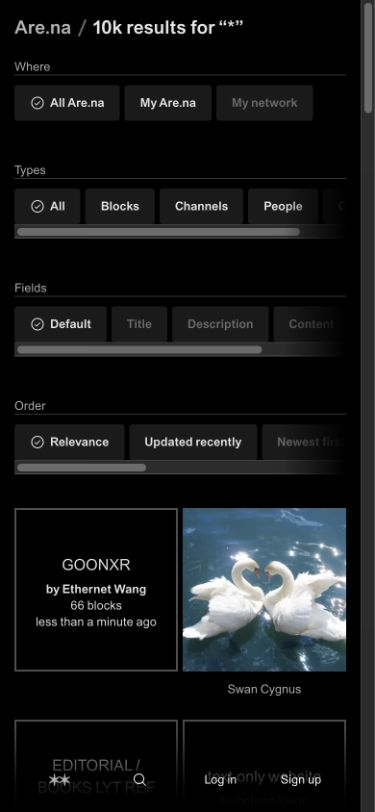

## [It’s Nice That — 편집 영역](https://www.itsnicethat.com/)

부분 참고 · 이미지와 읽는 순서

- **검토 질문:** 동일 카드 반복 없이 여러 작업을 보여줄 수 있는가?
- **관찰:** 대표 기사의 큰 이미지 뒤에 제목과 요약을 연결하고, 다른 기사로 이어간다. 캡처는 쿠키·뉴스레터 창을 닫은 뒤 본문 편집 영역이다.
- **가져올 원리:** 자료의 중요도에 따라 이미지 크기와 설명 위치를 달리한다.
- **리모 적용 제안:** 대표 프로젝트 한 개를 먼저 충분히 보여주고 나머지 작업은 짧게 연결한다. 제목은 내용을 구별하는 데 필요한 만큼만 쓴다.
- **필요한 실제 자료:** 큰 크기로 볼 가치가 있는 실제 작업 화면과 짧은 설명.
- **한계 / 가져오지 않을 것:** 잡지의 긴 제목·카테고리·피드·고정 메뉴는 리모에게 불필요하다. 편집 위계만 참고한다.
- **모바일 관찰:** 데스크톱의 이미지 아래 제목·요약 배치가 모바일에서 한 열로 이어진다. 캡처 위치는 반응형 재배치로 정확히 같은 스크롤 좌표가 아니다.

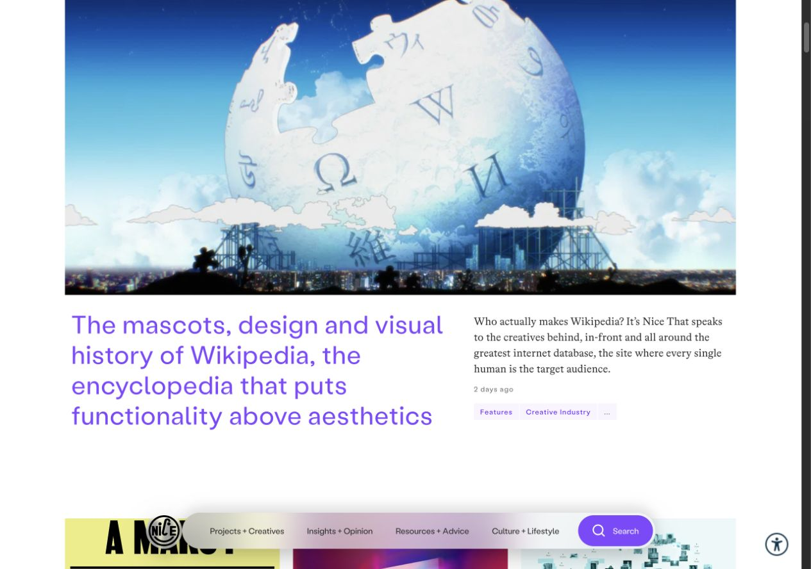

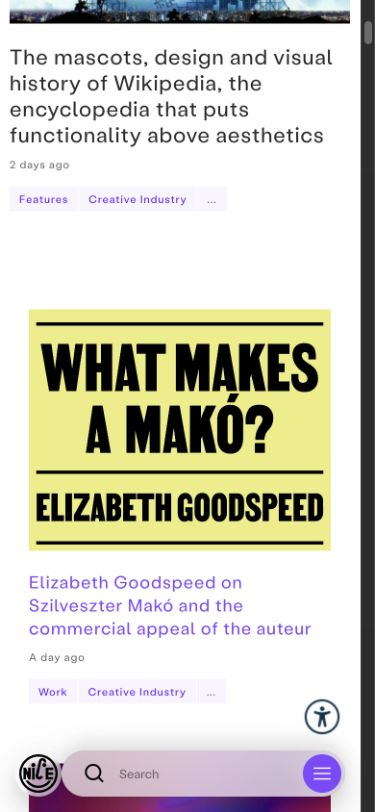

## [Ordinary People — 첫 화면](https://ordinarypeople.info/)

반면 사례 · 첫 화면 구성 제외

- **검토 질문:** 필요한 설명도 얼마나 앞에 놓아야 할까?
- **관찰:** 스튜디오 소개 뒤 프로젝트명·분류·설명을 놓고 큰 시각 작업을 이어간다. 모바일 첫 화면에서 여러 텍스트 블록을 지나야 작업 이미지에 닿는다.
- **가져올 원리:** 작업물 자체의 개성은 참고하되, 소개와 분류를 모두 전면에 쌓지 않는다.
- **리모 적용 제안:** 리모에서는 이미지 앞 설명을 줄이고 설명을 필요한 작업 옆으로 옮긴다.
- **필요한 실제 자료:** 내용을 대체할 수 있을 정도로 명확한 작업 이미지.
- **한계 / 가져오지 않을 것:** 이 사이트의 완성도와 별개로, 리모가 지금 줄이려는 텍스트 중심 진입을 재현할 수 있다. 쿠키 배너가 포함된 수집 장면이라는 점도 고려한다.
- **모바일 관찰:** 큰 소개와 프로젝트 정보가 길게 쌓이는 장면을 확인했다. 현재 리모의 첫 화면 방향으로는 제외한다.

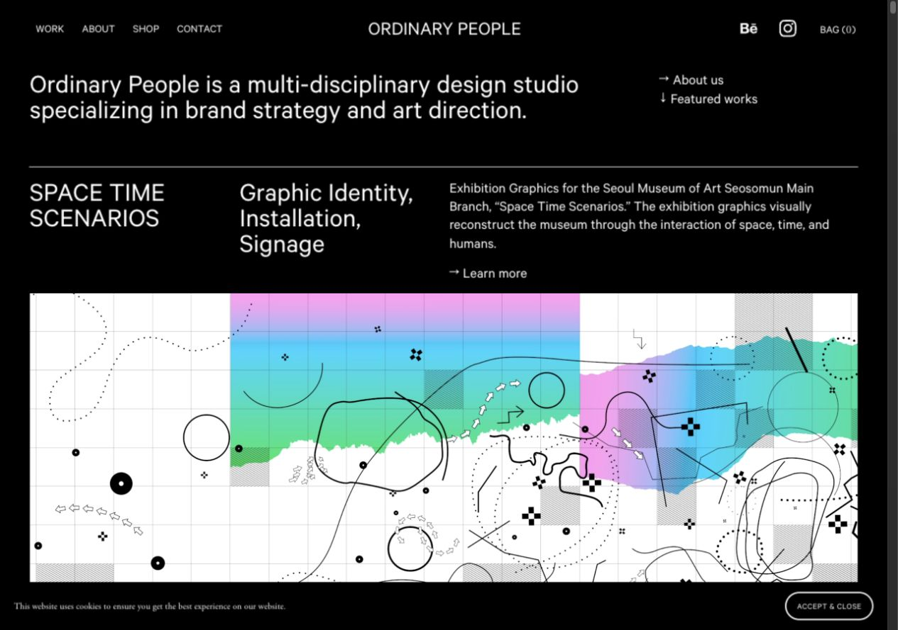

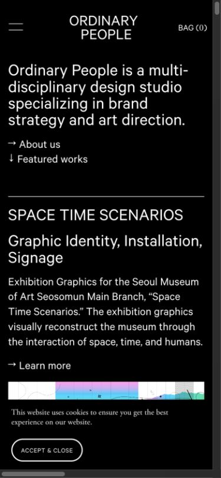

## [Studio RHL — 첫 화면](https://www.studiorhl.com/)

반면 사례 · 첫 화면 구성 제외

- **검토 질문:** 절제된 화면이면 리모에도 적합할까?
- **관찰:** 중앙 소개 문장과 넓은 여백이 첫 화면을 차지한다. 제작사 Noble Collective는 스케치와 현장 사진으로 과정을 다룬 디자인이라고 설명하지만, 현재 첫 화면에서는 그 자료가 주인공이 아니다.
- **가져올 원리:** 과정을 다룬다는 소개와 첫 화면에서 과정이 실제로 보이는지는 구별해야 한다.
- **리모 적용 제안:** 리모는 작업 장면을 보기 위해 큰 소개 화면을 먼저 통과하지 않게 한다.
- **필요한 실제 자료:** 첫 화면에 바로 놓을 수 있는 실제 작업 자료.
- **한계 / 가져오지 않을 것:** 차분하고 정돈된 분위기가 리모의 장난스럽고 투박한 에너지를 대신할 수 없다. 현재 첫 화면만 제외 판단하며 상세 전체를 부정하는 것은 아니다.
- **모바일 관찰:** 모바일에서도 소개와 여백이 큰 비중을 차지한다. 390px 재로드 후 캡처했다.

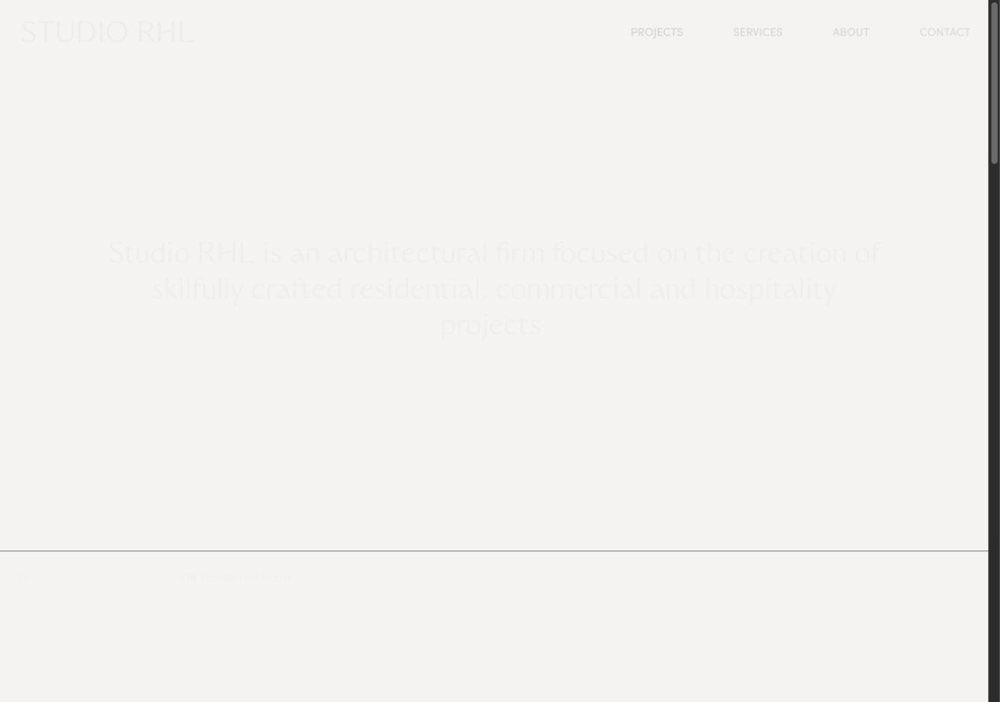

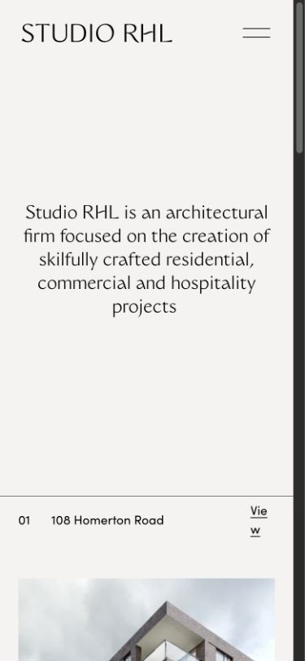

## 보류 후보

- [Public Possession](https://www.publicpossession.com/) — 보류 · 텍스트 확인/화면 미검증. 상점·음악·이벤트가 함께 있는 후보. 브라우저 보안 확인 화면으로 시각 평가를 중단했다.
- [Experimental Jetset](https://www.experimentaljetset.nl/) — 보류 · 접근 실패. 웹 조회와 브라우저 연결에 실패했다. 현재 디자인을 평가하지 않았다.
- [Luckysoap / J. R. Carpenter](https://www.luckysoap.com/) — 보류 · 텍스트만 확인. 개인 작품 아카이브 후보. 화면·모바일 확인을 우선 후보에 집중해 이번 선별에서는 채택하지 않았다.
- [Collective Futures](https://collectivefutures.eu/) — 보류 · 텍스트만 확인. 공동 실험과 학습의 내용은 관련 있지만, 현재 자료만으로 리모에 맞는 시각 원리를 확정하지 않았다.
- [Monotonomo](https://www.monotonomo.com/) — 보류 · 텍스트만 확인. 컨셉 연구와 인터페이스 실험을 기록하는 후보. 실제 팀 프로젝트 과정과 구분할 필요가 있어 우선순위를 낮췄다.

## 결론

Moniker의 행동 중심 첫 장면과 Conditional Design의 반복 결과 기록을 우선 참고한다. 큰 제목, 장식 라벨, 복잡한 필터와 영상 의존은 가져오지 않는다. 현재 사진만으로 개인의 성격이나 프로젝트 수정 과정을 증명할 수 없다.

다음 비교 방향은 A 사람의 작업 장면에서 시작 / B 실제 작업물에서 시작. 동일 자료로 순서와 비중만 달리해 비교한다. 이번 단계에서는 두 시안을 제작하지 않았다.

보충 출처: https://www.nobleco.studio/studio-rhl , https://www.are.na/about
